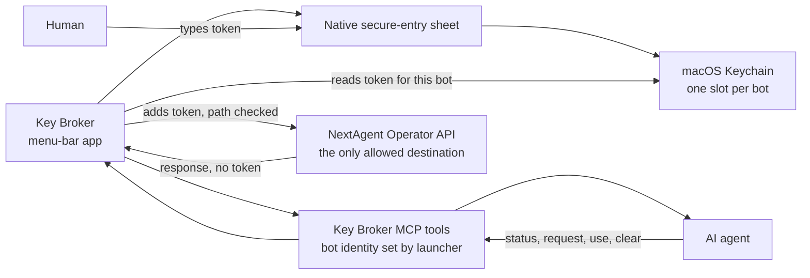

# Key Broker

**A small macOS vault that lets AI agents use an API token without ever seeing it.**

---

## What it is

AI agents increasingly need credentials to do useful work, and every obvious way of giving them one leaks it. Paste a token into the chat and it sits in the transcript. Put it in the agent's environment and the agent can print it. Hand the agent a generic "add this header to any request" helper and it can send the token anywhere.

Key Broker is Emergent's answer for agents running on a Mac. The human types the token once, into a native macOS dialog that the agent can't see. The token goes into the macOS Keychain, filed under the specific bot that asked for it. From then on the agent can ask Key Broker to make a request on its behalf, and Key Broker attaches the token itself, but only on requests to one approved API. The agent gets the response, never the secret.

It's a deliberately small tool: about 2,000 lines of Swift, built in a day in August 2026. Version 1 has exactly one connector, the Operator API of [NextAgent](https://github.com/codeslayer44/nextagent-showcase), Emergent's in-house agent control plane, so an agent on a Mac can brief and check on other agents without holding a NextAgent credential.

## Highlights

- **The agent never holds the secret.** The token is typed only into Key Broker's own secure-entry sheet, stored in the Keychain, and attached to outgoing requests inside Key Broker. Nothing the agent can call returns it, and it never appears in the agent's environment, files, logs or the menu-bar UI.
- **One slot per bot, and the bot doesn't get to pick.** Each token is stored against one bot's identity. That identity is supplied by the app that launches the agent, not by anything the model says, and Key Broker's agent tools refuse to start without it. A bot's tools reach only that bot's own slot.
- **Only the approved API, only by path.** The agent asks for a path, not a URL. Full URLs, protocol tricks, parent-directory segments and query-string games are rejected before any network call, and a redirect to a different host is refused, so the token can only ever reach the one API it was issued for.
- **Four plain tools for the agent.** Check whether a token is set, ask the human for one, make a request with it, or clear it. Asking and clearing both put a native dialog in front of the human, so the person stays in the loop for every change.
- **Feels like a Mac app.** A menu-bar app shows which bots have a token configured (never the value), lets the human clear a slot, and starts at login. Agents reach it through a standard MCP server, so any MCP-capable agent can use it.
- **Leak-focused tests.** 30 automated tests (Swift Testing) cover per-bot isolation, the path rules, refusing redirects to other hosts, error messages that never carry secrets and a dedicated check that no response ever carries the token; a shell test confirms the agent tools won't start without a bot identity.

## How it works

1. The agent asks whether its bot has a token. If not, it calls *request*, and Key Broker shows a dialog titled with the bot's name and the one place the token will be sent.
2. The human types the token there. Key Broker saves it to the Keychain under that bot.
3. The agent calls *use* with a method and a path. Key Broker checks the path, looks up the token for that bot, adds it to the request, sends it to the approved API and returns the response with the credential header removed.
4. *Clear* asks the human to confirm, then deletes that bot's slot.

## Engineering notes

**Design from the leak paths backwards.** The design starts by listing every way an agent could end up holding the token (chat transcript, environment variables, workspace files, a generic request helper, a crafted URL, a redirect) and closes each one. The resulting tool surface is small on purpose: there is simply no call that hands the secret back.

**Identity comes from the host, not the model.** A model can claim to be anyone. Key Broker therefore never accepts a bot ID as a tool argument and has no default identity: the launching app sets the bot's identity when it starts the agent's tool process, and if it doesn't, the tools exit instead of guessing. Getting this wrong wouldn't reveal a token, but it would let one bot spend another's, so it is enforced and tested rather than left to configuration.

**A path allowlist instead of a URL allowlist.** Checking a full URL against an allowlist invites parsing disagreements. Key Broker accepts only a path, rejects anything that could change the host or escape the API's prefix, and builds the final URL itself from fixed parts. Redirects are followed only within the same host.

**Two slots where one wasn't enough.** A bot can hold a second, separate token for a different kind of NextAgent access, so adding one role doesn't overwrite the other. Slot names are a fixed list, so the vault can't be turned into a general-purpose secret store by accident.

## Tech stack

| Layer | Technology |
|---|---|
| Language | Swift 6, Swift Package Manager |
| App | AppKit menu-bar app, native secure text entry |
| Storage | macOS Keychain (this-device-only items) |
| Agent interface | MCP server (stdio) |
| Networking | URLSession with a same-host redirect guard |
| Install | Shell installer, launchd login agent |
| Testing | Swift Testing, shell contract test |

## By the numbers

| | |
|---|---|
| Commits | 19 |
| Active development | 2026-08-14 |
| Tracked files | 36 |
| Lines of source | ~2,000 |
| Automated tests | 30 Swift tests in 9 suites, plus 1 shell contract test |
| Languages | Swift 97.1%, Shell 2.8% |

## About this repo

Key Broker's source code is private. This repository describes the project: what it does, how it is built, and the engineering choices behind it. No source code is published here.

Built by [Emergent AI Agency](https://emergentaiagency.com) (Ryan Chappell). For demos or consulting, get in touch through [emergentaiagency.com](https://emergentaiagency.com).
